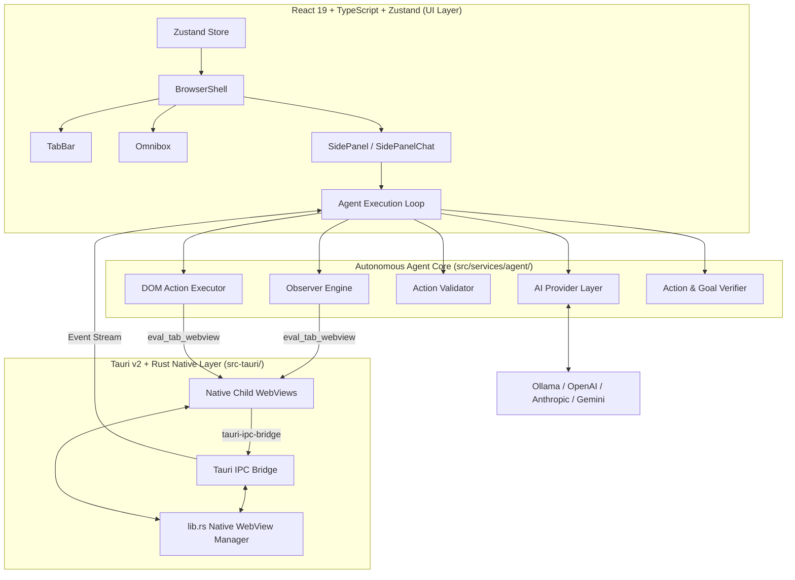
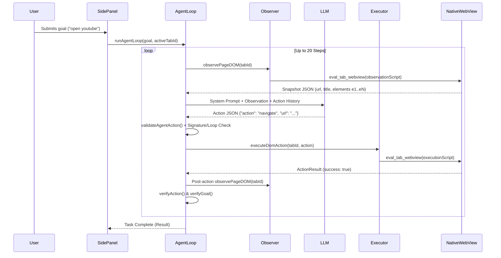

# ARIA V2 — Browser AI Architecture Documentation

## Overview

**ARIA** (Automated Reasoning & Intelligent Agent Browser) is a state-of-the-art AI-native web browser built with **React 19**, **TypeScript**, **Zustand**, and **Tauri v2** (Rust native child WebViews). It combines native multi-tab web browsing with an **Autonomous Browser Agent** powered by local LLMs (Ollama / LM Studio) or cloud providers (OpenAI, Anthropic, Google Gemini).

---

## High-Level System Architecture



---

## Architecture Components

### 1. Native Backend Layer (`src-tauri/src/lib.rs`)

The native backend is written in Rust using Tauri v2. It manages dynamic OS native child WebViews (WebView2 on Windows, WebKit on macOS/Linux).

- **Child WebView Lifecycle**:
  - `create_tab_webview(app, window, webview_label, url, x, y, width, height)`: Spawns a native child webview positioned dynamically within the shell layout.
  - `navigate_tab_webview(app, webview_label, url)`: Controls URL navigation for a target webview.
  - `destroy_tab_webview(app, webview_label)`: Safely destroys child webview instances on tab close.
  - `resize_tab_webview(app, webview_label, x, y, width, height)`: Adjusts webview position and bounds synchronously when the UI layout changes (e.g. sidepanel toggle or window resize).
- **JavaScript Injection & IPC Bridge**:
  - `eval_tab_webview(app, webview_label, js)`: Injects JavaScript snippets (`observationScript`, `executionScript`) directly into the child webview DOM context.
  - `tauri-ipc-bridge`: Intercepts navigation requests to `https://tauri-ipc-bridge/data?payload=...` sent by injected scripts. Decodes the payload and emits Tauri events (`page-content-tab-${label}`) back to the React frontend.

---

### 2. Frontend & UI Shell (`src/components/`)

- **[BrowserShell.tsx](file:///c:/Users/B%20Gowtham%20Reddy/.vscode/Browser-AI-master/src/components/BrowserShell.tsx)**: Main application container. Manages webview bounds calculation and syncs native webview window sizes with React UI layout via `useBrowserStore`.
- **[TabBar.tsx](file:///c:/Users/B%20Gowtham%20Reddy/.vscode/Browser-AI-master/src/components/TabBar.tsx)**: Multi-tab navigation header supporting tab creation, switching, and closing.
- **[Omnibox.tsx](file:///c:/Users/B%20Gowtham%20Reddy/.vscode/Browser-AI-master/src/components/Omnibox.tsx)**: Address bar with search suggestions, URL navigation, and global "Ask AI" triggers.
- **[SidePanel.tsx](file:///c:/Users/B%20Gowtham%20Reddy/.vscode/Browser-AI-master/src/components/SidePanel.tsx)**: Primary AI sidebar housing the agent entry point (`runAgentForMessage`), Q&A chat stream, task timeline, technical log feed, and developer debug console (`AgentDebug.tsx`).
- **[SidePanelChat.tsx](file:///c:/Users/B%20Gowtham%20Reddy/.vscode/Browser-AI-master/src/components/sidepanel/SidePanelChat.tsx)**: Unified chat interface supporting user messages, assistant responses, and interactive embedded **Browser Agent Execution Cards**.
- **[Settings.tsx](file:///c:/Users/B%20Gowtham%20Reddy/.vscode/Browser-AI-master/src/components/Settings.tsx)**: Provider selection modal (Ollama, OpenAI, Anthropic, Gemini, LM Studio) and API key configuration.

---

### 3. State Management (`src/store/browserStore.ts`)

Built with **Zustand**, tracking global application state:
- Active tabs list (`tabs: Tab[]`) and current active tab ID (`activeTabId`).
- Webview layout geometry (`webviewBounds`).
- SidePanel toggle state (`sidebarOpen`).
- User settings (`settings: BrowserSettings`).
- Native webview action wrappers (`addTab`, `closeTab`, `setActiveTabId`, `navigateActiveTab`).

---

### 4. Autonomous Agent Pipeline (`src/services/agent/`)

The agent operates in a strict closed-loop cycle: **OBSERVE → PLAN → EXECUTE → VERIFY → OBSERVE → ... → DONE**.



#### Core Modules:
1. **[agentLoop.ts](file:///c:/Users/B%20Gowtham%20Reddy/.vscode/Browser-AI-master/src/services/agent/agentLoop.ts)**:
   - **Single-Runner Lock**: Global `activeGlobalRunId` and `cancelActiveAgentRun()` ensure only one agent loop controls the browser at a time.
   - **Step Limit**: Enforces a strict 20-step cap per task.
   - **Identical Action Protection**: Generates normalized action signatures (`getActionSignature`) and observation hashes (`getObservationHash`). If an action is repeated on an identical observation hash, it is blocked immediately and the LLM is instructed to choose a different action.
   - **Goal Verification**: Rejects premature `done` declarations if search input text was typed without subsequent form submission (`press` Enter or `click` Search button) or page navigation.
2. **[observer.ts](file:///c:/Users/B%20Gowtham%20Reddy/.vscode/Browser-AI-master/src/services/agent/observer.ts)**:
   - Injects `observationScript` into the active webview.
   - Assigns scoped `aria-agent-id="e1"`, `aria-agent-id="e2"`, ... attributes.
   - Captures element tag, role, type, name, text, placeholder, ariaLabel, value, visibility, enabled state, and geometry (`rect: { x, y, width, height }`).
3. **[actions.ts](file:///c:/Users/B%20Gowtham%20Reddy/.vscode/Browser-AI-master/src/services/agent/actions.ts)**:
   - Defines strict action types: `navigate`, `click`, `type`, `press`, `select`, `scroll`, `activate_tab`, `wait`, `done`, `fail`.
   - Validates JSON and normalizes legacy action signatures (`press_key` → `press`, `new_tab` → `navigate target="new_tab"`).
4. **[executor.ts](file:///c:/Users/B%20Gowtham%20Reddy/.vscode/Browser-AI-master/src/services/agent/executor.ts)**:
   - Injects `executionScript` to perform real DOM interactions.
   - Dispatches full synthetic event sequences (`pointerdown`, `mousedown`, `pointerup`, `mouseup`, `click`).
   - Uses prototype descriptor setters on `<input>` / `<textarea>` elements to trigger React/Vue framework state listeners, followed by `InputEvent('input')` and `Event('change')`.
   - Handles `Enter` key press by dispatches keydown/keyup events and invoking form `.requestSubmit()` / `.submit()`.

---

### 5. AI Service Layer (`src/services/ai.ts`)

Abstracts streaming chat completion APIs for multiple AI backends:
- **Ollama**: Local REST API (`http://localhost:11434/api/chat`).
- **OpenAI**: Chat completions endpoint (`https://api.openai.com/v1/chat/completions`).
- **Anthropic**: Messages API (`https://api.anthropic.com/v1/messages`).
- **Google Gemini**: Generative language REST API.
- **LM Studio**: Local OpenAI-compatible endpoint (`http://localhost:1234/v1/chat/completions`).

---

### 6. Local Database & Persistence (`src/services/db.ts`)

Uses browser **IndexedDB** (`BrowserAIDB`):
- `chat_history`: Persists user messages, assistant responses, and serialized agent task states (`__AGENT_DATA__:...`) per tab.
- `settings`: Stores AI provider preferences and API keys securely in local database storage.

---

## Directory Structure

```text
Browser-AI-master/
├── src/
│   ├── components/
│   │   ├── BrowserShell.tsx       # Main window layout & webview bounds sync
│   │   ├── Omnibox.tsx            # Address bar & AI triggers
│   │   ├── ReaderMode.tsx         # Article reader view
│   │   ├── Settings.tsx           # AI configuration modal
│   │   ├── SidePanel.tsx          # Agent UI, task stream, & debug panel
│   │   ├── TabBar.tsx             # Tab management bar
│   │   └── sidepanel/
│   │       ├── AgentDebug.tsx     # Developer debug log console
│   │       └── SidePanelChat.tsx  # Message feed & Agent Execution Cards
│   ├── services/
│   │   ├── agent/
│   │   │   ├── actions.ts         # Action schema & validation
│   │   │   ├── agentLoop.ts       # Closed-loop execution engine & verification
│   │   │   ├── executor.ts        # DOM script execution & event dispatch
│   │   │   └── observer.ts        # DOM snapshot & element extraction
│   │   ├── agent.ts               # Agent URL normalizer & helpers
│   │   ├── ai.ts                  # Provider integrations (Ollama/OpenAI/Claude/Gemini)
│   │   ├── db.ts                  # IndexedDB database service
│   │   └── utils.ts               # JSON extractors & helper utilities
│   ├── store/
│   │   └── browserStore.ts        # Zustand application store
│   ├── types/
│   │   └── index.ts               # Core TypeScript interface definitions
│   ├── App.tsx
│   └── main.tsx
├── src-tauri/
│   ├── src/
│   │   ├── lib.rs                 # Native child webview manager & IPC bridge
│   │   └── main.rs                # Tauri entry point
│   ├── Cargo.toml
│   └── tauri.conf.json
├── package.json
└── vite.config.ts
```
